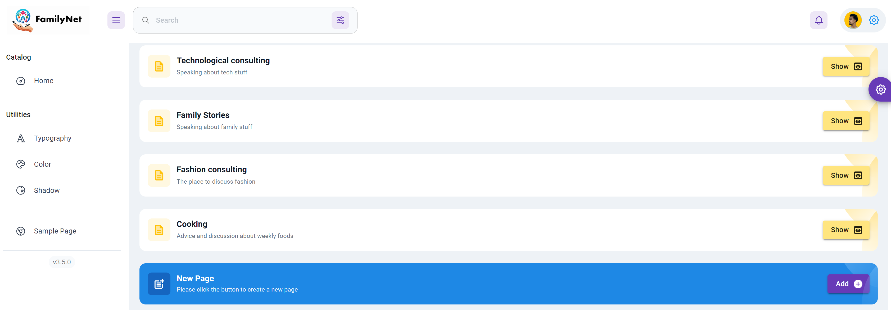

# MyFamilyNet Frontend

MyFamilyNet is a frontend application built using :
1) React , Vite Frontend frameworks.
2) Keycloak Authentication with keycloak auth server.
3) CI/CD - Github Actions(CI) ,[ArgoCD (CD)](https://github.com/almog2290/MyFamliyNet-k8s). 